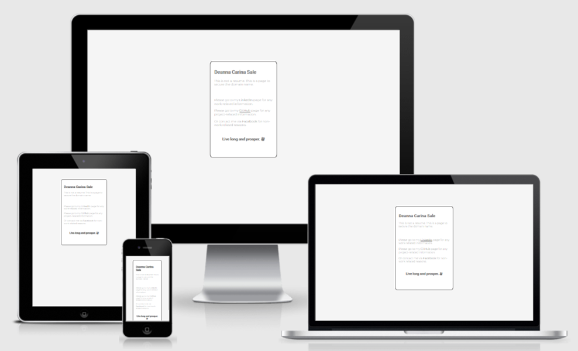
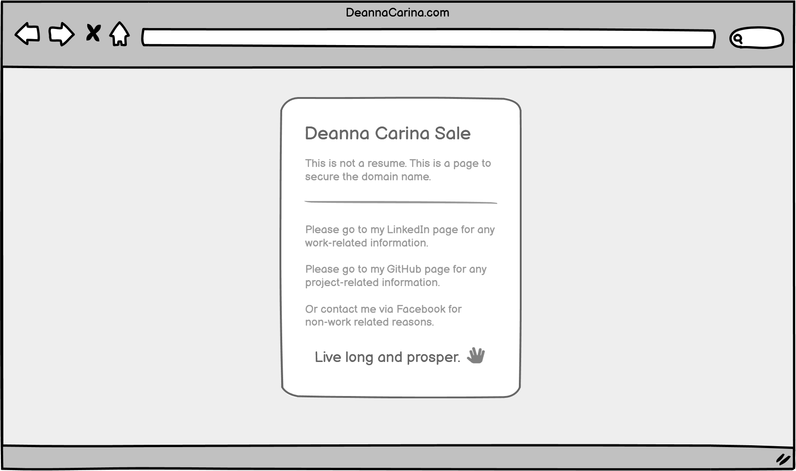
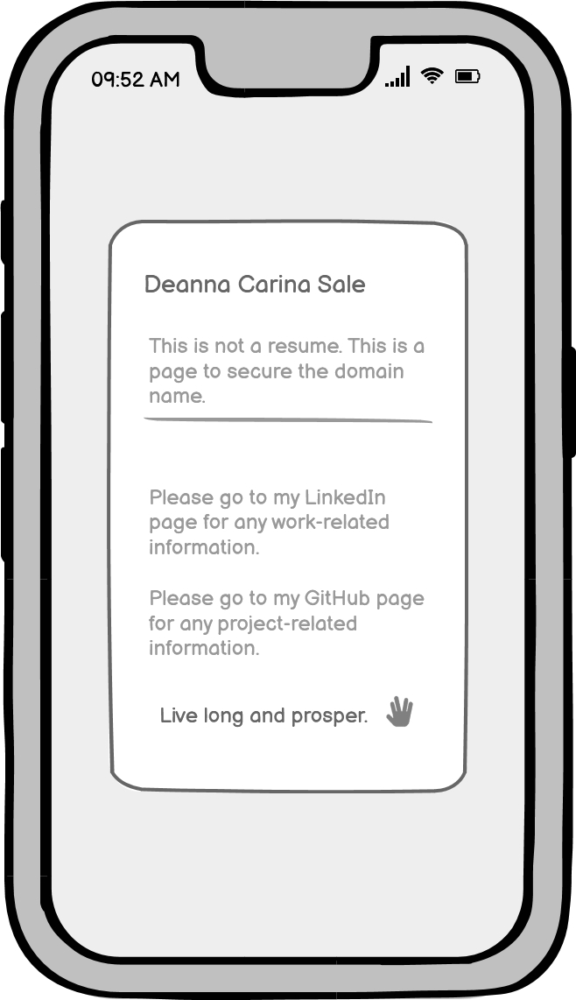
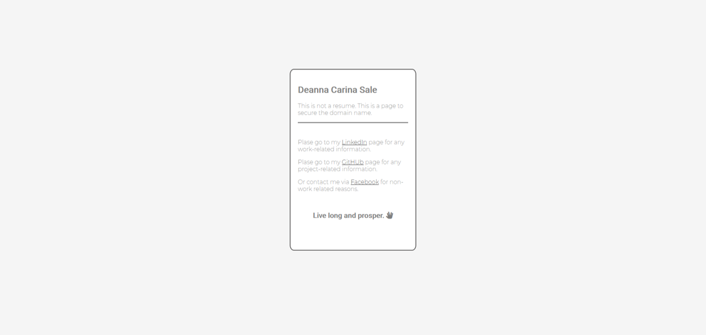

# DeannaCarina

## Contents
<ul>
    <li><a href="#Introduction">Introduction</a></li>
    <li><a href="#UX">UX</a></li>
    <li><a href="#Technologies">Technologies</a></li>
    <li><a href="#Features">Features</a></li>
    <li><a href="#Testing">Testing</a></li>
    <li><a href="#Deployment">Deployment</a></li>
    <li><a href="#Credits">Credits</a></li>
    <li><a href="#Screenshots">Screenshots</a></li>
</ul>

## Introduction

This is a webpage to secure the domain name of "DeannaCarina.com" it is not a resume or a portfolio of work, however it has the potential to become that in the future.
At the moment it's main purpose is to redirect people to my other social media/software development platforms: <a href="https://www.facebook.com/DeannaCarina" target="_blank">Facebook</a>, <a href="https://github.com/DeannaCarina" target="_blank">GitHub</a>, and <a href="https://www.linkedin.com/in/deannacarina/" target="_blank">LinkedIn</a>.  
A live demo of the website can be found <a href="https://www.deannacarina.com/"><strong>HERE</strong></a> 

 

## UX
### Strategy
### Scope
### Structure
### Steleton
The wireframes for this website were made using Balsamiq. Wireframes were made for deskptop and mobile versions. Final website may differ slightly from the wireframes.  
  

### Surface

## Technologies

## Features

## Testing

## Deployment

## Credits

## Screenshots
