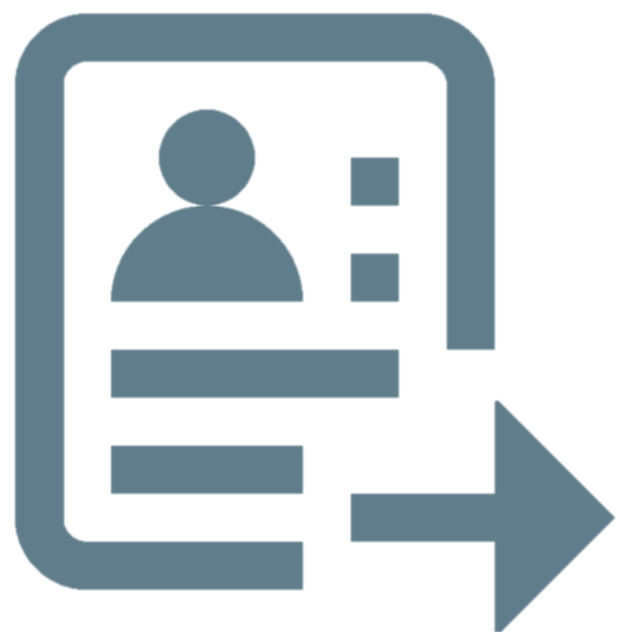
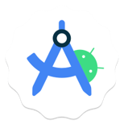
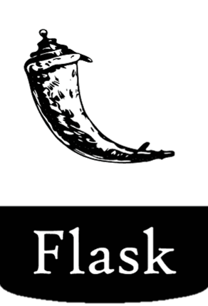

### Hi there, I'm Deanna 👋 

<a href="https://deannacarina.github.io/Resume/"> Resume</a> 
<a href="https://www.facebook.com/DeannaCarina/"> Facebook</a> 
<a href="https://www.linkedin.com/in/deannacarina/"> LinkedIn</a> 

## Dog-mother, learner, and carer.

- 🔭 Software development has been a hobby of mine for the best part of 10 years.
- 🌱 I’m due to step into the software industry as a career in Aug2023 after spending 12 years in the NHS.
- 👯 I’m looking to collaborate with other content creators on small projects.
- ⚡ Fun fact: I love to design and make craft projects from scratch.

### Languages and Tools:

                                                                   

 
 
